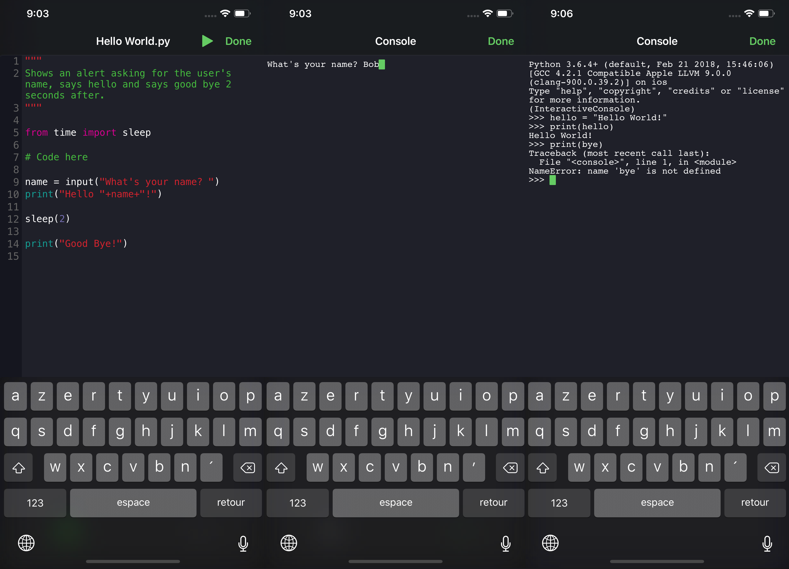

# Pyto

Pyto is a Python IDE for iOS that uses the Python C API.



```
Pyto is a Python 3.6 IDE for iPhone an iPad. You can run code directly on your device and offline.

Features:

  - Python 3.6 with all default libraries like "sys"
  - Pre-installed modules for interacting with the app
  - Full Python REPL  
  - Standard file browser
```

## Building

1. [Download Python for iOS](https://s3-us-west-2.amazonaws.com/pybee-briefcase-support/Python-Apple-support/3.6/iOS/Python-3.6-iOS-support.b6.tar.gz).
2. Unarchive the file.
3. Copy `BZip2`, `OpenSSL` , `XZ` and `Python` to the repo.
