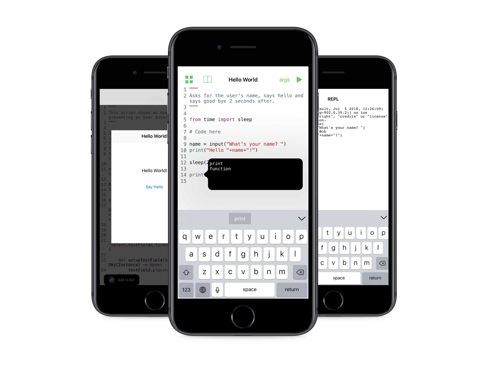

<p align="center">
<a href="https://github.com/ColdGrub1384/Pisth">Pisth</a> &bull;
<a href="https://github.com/ColdGrub1384/Edidown">Edidown</a> &bull;
<b>Pyto</b> &bull;
<a href="https://github.com/ColdGrub1384/Luade">Luade</a>
</p>

Follow [@develobile](https://twitter.com/develobile) on Twitter for news about my projects.


# Pyto

[](https://itunes.apple.com/us/app/pyto-python-ide/id1436650069?l=fr&ls=1&mt=8)



```
Pyto is a Python 3.7 IDE for iPhone an iPad. You can run code directly on your device and offline.

Features:

  - Python 3.7 with all default libraries like "sys"
  - Pre-installed modules for interacting with the app
  - Full Python REPL
  - Use your own modules on your scripts
  - Code an user interface with the same UIKit interface
  - Smart code completion
  - Numpy 1.16.1, Matplotlib 3.0.2 and Pandas 0.24.1 included
  - Use pip to install pure Python modules from PyPi
```

## TODO

- [ ] Add a setting to not clear the console before running a script

# Known bugs

- [ ] Bug while dragging console vertically
- [ ] Cannot select code completions from the middle

## Building

`$ ./setup.sh` and build the `Pyto` target from `Pyto.xcworkspace`

## Contributing

Thanks to [@cclauss](https://github.com/cclauss) and [@goodclass](https://github.com/goodclass) for contributions.

If you want to add a library to the app, see [this](PORT_LIBRARY.md).
